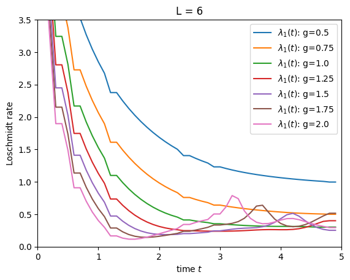

# Simulating Quantum Many-Body Dynamics on a Superconducting Digital Quantum Computer using Qiskit

**FOPRA 34, June 2023**

Unlike classical computers, quantum computers harness quantum mechanical properties such as superposition and entanglement. 
For this reason, quantum computers are expected to be more powerful than classical computers. 
Enormous progress has been made over the last decades in building a universal and practical quantum computer. Nowadays, many quantum platforms are available, such as cold atoms in optical lattices, trapped ions, superconducting qubits and photonic qubits, which are not yet fault-tolerant, but suffer from noise due to interaction with the environment. 
Among these platforms, superconducting qubits are, for their flexibility and scalability, one of the leading candidates for building a practical large-scale quantum computer.

One of the most promising application of quantum computers lies in the simulation of interacting quantum many-body systems, which become rapidly prohibitive to describe using classical computers.
In this practical, we use Qiskit - the open-source software development kit of IBM's superconducting quantum hardware - to simulate the phenomenon of Dynamical Phase Transitions (DQPTs) in a transverse field Ising model.
By converting the closed system quantum dynamics into a corresponding quantum circuit, we extract relevant observables such as the magnetization, the Loschmidt echo, and the entanglement dynamics from it. 
We also employ simulation methods such as Trotterization and quantum state tomography and, by applying noise models such as the generalized amplitude damping channel, account for the fact that current quantum devices are not fault-tolerant but prone to errors due to the interaction with the environment.

The theoretical description of the simulation problems as well as the programming and mathematical tasks are provided in `instructions/`[^1].

Our final report is [here](/report.pdf).

| Loschmidt Rate  | Energy Measurement  | Trotterized Unitary |
| :------------: |:---------------:| :-----:|
|  | 
 | 
 |

| von Neumann and Rènyi entropy | Loschmidt Echo/Rate and Magnetization | VQE Ansatz |
| :------------: |:---------------:| :-----:|
|  |  |    |

--------------------------------------------------------
## Authors
* Daniel Ortmann
* Patrick Hopf
* Philipp Thoma

--------------------------------------------------------
## Reference

[^1]: Prof. Dr. Michael Knap., 2023. Simulating quantum many-body dynamics on a current digital quantum computer. Technical University Munich, Physics Department. [Sources.](/instructions/)
